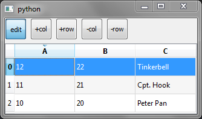
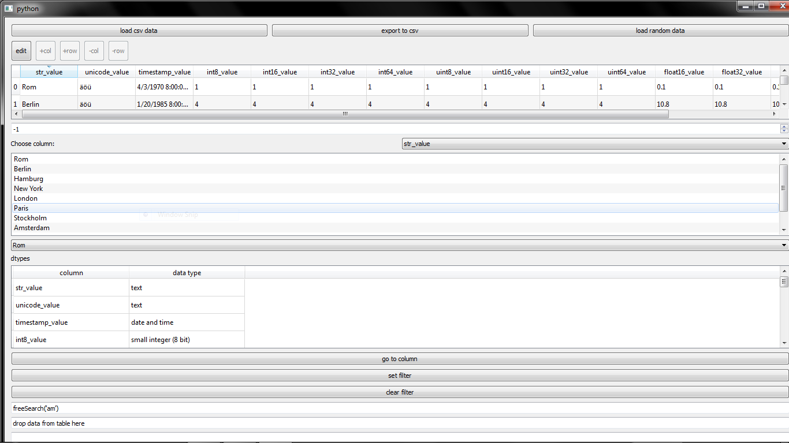

# qt5pandas
# Modify to use PyQt5


### Utilities to use [pandas](https://github.com/pandas-dev/pandas)  (the data analysis/manipulation library for Python) with Qt.

## Project Information

<table>
    <tr>
        <td>Latest Release</td>
        <td></td>
    </tr>
    <tr>
        <td>Package Status</td>
        <td></td>
    </tr>
    <tr>
    <tr>
        <td>Build Status</td>
        <td>
            <a href="https://travis-ci.org/draperjames/qt5pandas">
            
            </a>
        </td>
    </tr>
<!--     <tr> -->
  <td>PyPI</td>
  <td>
    <a href="https://pypi.python.org/pypi/qt5pandas/">
    
    </a>
  </td>
</tr>
</table>

[](https://www.codacy.com/app/james-draper/qt5pandas?utm_source=github.com&amp;utm_medium=referral&amp;utm_content=draperjames/qt5pandas&amp;utm_campaign=Badge_Grade)
[](https://gitter.im/qt5pandas/Lobby#)
[](https://github.com/draperjames/qt5pandas/issues)
[](https://github.com/draperjames/qt5pandas/issues)

## Requirements;
> Python 3.5 or greater
> PyQt5

## Install
To install run the following in the command prompt;
```
pip install qt5pandas
```
If that doesn't work try installing the lastest version of easy gui;
```
pip install --upgrade git+https://github.com/robertlugg/easygui.git
```
If that doesn't work then please [report an issue](https://github.com/draperjames/qt5pandas/issues)

To use, create a new Python script containing the following:
```
from PyQt4.QtCore import *
from PyQt4.QtGui import *

from qt5pandas.views.CSVDialogs import CSVImportDialog

if __name__ == "__main__":
    from sys import argv, exit

    app = QApplication(argv)
    dialog = CSVImportDialog()
    dialog.show()
    app.exec_()
```
# Examples

These can be found in qt5pandas/examples.

- BasicExmple.py



- Here is TestApp.py



# Development

## Wanna contribute?
Any feedback is apprecaited.
- Report an issue
- Check out the wiki for development info (coming soon!)
- Fork us.

Forked from @datalyze-solutions's [master](https://github.com/datalyze-solutions/pandas-qt).
